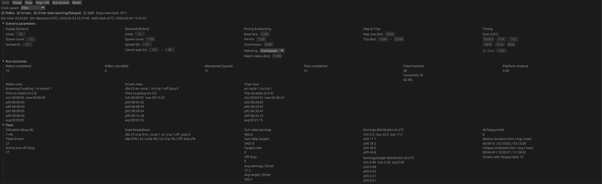
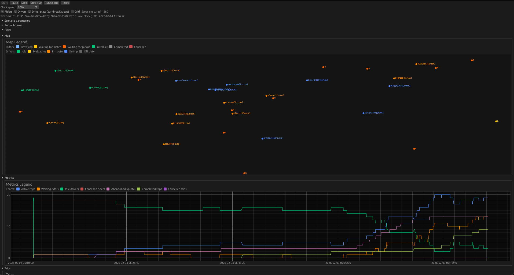
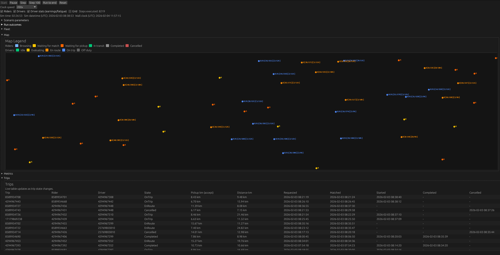

# Ride-Hailing Simulation

A high-performance, discrete-event simulation of a ride-hailing marketplace built in Rust. This project demonstrates advanced simulation techniques, spatial indexing, and real-time visualization for modeling complex multi-agent systems.

## Overview

This simulation models a ride-hailing marketplace (similar to Uber/Bolt) with realistic demand and supply patterns, driver-rider matching algorithms, and comprehensive telemetry. It's built using:

- **Discrete Event Simulation (DES)**: Millisecond-precision event scheduling with deterministic execution
- **Entity Component System (ECS)**: Efficient multi-agent state management using Bevy ECS
- **H3 Spatial Indexing**: Geographic indexing for efficient spatial queries and matching
- **Real-time Visualization**: Native UI built with egui for live simulation monitoring

The simulation supports hundreds of concurrent riders and drivers, realistic time-of-day demand patterns (rush hours, day/night variations), and multiple matching algorithms for driver-rider pairing.

## Features

### Core Simulation
- **Discrete Event System**: Binary heap-based event queue with deterministic ordering
- **Dynamic Spawning**: Time-of-day aware spawners for riders and drivers with configurable distributions
- **State Machine**: Complete lifecycle modeling (browsing → quote accept/reject → waiting → matched → en route → completed/cancelled). Riders can reject quotes and request another, or give up after N rejections.
- **Driver Behavior**: Earnings targets, fatigue thresholds, and off-duty transitions
- **Pricing System**: Distance-based fare calculation with configurable base fare, per-km rate, and commission rates. Optional surge pricing applies dynamic multipliers when demand exceeds supply in local H3 clusters. Tracks driver earnings and platform revenue separately.

### Matching Algorithms
- **Simple Matching**: First-available driver within radius
- **Cost-Based Matching**: Optimizes for pickup distance and estimated time of arrival (ETA)
- **Hungarian (Batch)**: Global optimization via Kuhn–Munkres; minimizes total cost across a batch of riders and drivers
- **Batch matching mode**: Optional scheduler runs a global matching pass every N seconds (configurable); when enabled, per-rider `TryMatch` is not used. Rejected riders re-enter the next batch automatically.
- **Extensible**: Trait-based design allows additional algorithms (e.g., opportunity cost)

### Spatial Features
- **H3 Grid System**: Resolution 9 (~240m cell size) for efficient spatial operations
- **Configurable Match Radius**: Match riders to drivers within N H3 cells
- **Haversine Distance**: Accurate distance calculations for trip pricing

### Visualization & Analytics
- **Real-time Map**: Live visualization of riders and drivers with state-based coloring
- **Time-series Charts**: Track active trips, waiting riders, idle drivers, cancellations, abandoned (quote), completed and cancelled trips
- **Trip Table**: Detailed trip information with timestamps and distances
- **Export**: Parquet export for completed trips, snapshots, and agent positions

### Realistic Patterns
- **Time-of-Day Distributions**: Rush hour multipliers (7-9 AM, 5-7 PM peak demand)
- **Day-of-Week Variations**: Different patterns for weekdays vs. weekends
- **Driver Supply Patterns**: More consistent than demand, with rush hour availability spikes

### Experimentation & Analysis
- **Parameter Sweeps**: Run multiple simulations in parallel with varying parameters (pricing, supply/demand, etc.)
- **Marketplace Health Scoring**: Calculate weighted health scores combining conversion, revenue, driver payouts, and timing metrics
- **Result Export**: Export experiment results to Parquet/JSON for analysis
- **Optimal Parameter Discovery**: Find parameter combinations that maximize marketplace health

## Architecture

### High-Level Design

```
┌─────────────────┐
│   Simulation    │
│     Clock       │ ← Binary heap event queue
└────────┬────────┘
         │
         ▼
┌─────────────────┐
│  Event Router   │ ← Pops events sequentially, inserts CurrentEvent
└────────┬────────┘
         │
         ▼
┌─────────────────┐
│   ECS Systems   │ ← React to CurrentEvent, mutate entities
│                 │   (execute sequentially in fixed order)
└────────┬────────┘
         │
         ▼
┌─────────────────┐
│  Telemetry &    │ ← Snapshot capture, Parquet export
│    Export       │
└─────────────────┘
```

**Execution Model**: The simulation executes **sequentially**—one event at a time.
The runner pops the next event from the clock, sets it as `CurrentEvent`, then runs
all systems in a fixed order. This ensures deterministic behavior and makes the
simulation easier to reason about. Parallelism is intended for running multiple
simulation runs simultaneously (Monte Carlo experiments), not for parallelizing
agents within a single simulation.

### Key Components

**Clock (`sim_core::clock`)**
- Millisecond-precision timeline
- Binary heap for O(log n) event insertion/removal
- Deterministic ordering for same-timestamp events
- Epoch support for real-world datetime mapping

**ECS (`sim_core::ecs`)**
- Components: `Rider`, `Driver`, `Trip`, `Position`
- States: `RiderState`, `DriverState`, `TripState`
- Resources: `SimulationClock`, `MatchRadius`, `MatchingAlgorithm`

**Systems (`sim_core::systems`)**
- Event-driven: React to `CurrentEvent` resource
- Targeted: Use `EventSubject` to target specific entities
- Modular: Each system handles one aspect (matching, movement, etc.)
- **Sequential execution**: Systems run one after another in a fixed order for each event

**Spatial (`sim_core::spatial`)**
- H3 resolution 9 wrapper
- Grid disk queries for radius-based matching
- Haversine distance calculations

**Matching (`sim_core::matching`)**
- Trait-based algorithm interface with `find_match` and `find_batch_matches`
- Implementations: Simple, CostBased, Hungarian (batch global optimization)
- Batch matching runs on a schedule; optional simulation end time bounds run length

## Usage

### Setup

This project uses `mise` for toolchain management:

```sh
# Install Rust toolchain
mise install

# Activate mise in your shell (if not already active)
mise activate
```

### Running the Simulation

**Command-line example:**
```sh
# Run tests
cargo test -p sim_core

# Run example scenario (500 riders, 100 drivers, 4 hours)
cargo run -p sim_core --example scenario_run

# Export to Parquet (optional)
SIM_EXPORT_DIR=/path/to/export cargo run -p sim_core --example scenario_run
```

**Interactive UI:**
```sh
# Launch visualization UI
cargo run -p sim_ui
```

The UI provides:
- Real-time map visualization with state-based coloring and optional grid overlay
- Interactive parameter adjustment organized in five columns:
  - Supply (drivers: initial, spawn count, spread)
  - Demand (riders: initial, spawn count, spread, cancel wait)
  - Pricing & Matching (base fare, per km rate, commission rate, surge pricing controls, matching algorithm, match radius)
  - Map & Trips (map size, trip length range)
  - Timing (simulation start time, seed)
- Time-series charts (active trips, waiting riders, idle drivers, cancellations, abandoned quotes, completed/cancelled trips)
- Trip detail table (all trips with timestamps, distances, and states)
- Playback controls (start, step, step 100, run/pause, run to end, reset, speed multiplier 10x-200x)
- Fleet metrics (utilization, earnings distributions, fatigue tracking)
- Run outcomes (conversion rates, timing distributions with percentiles, platform revenue)

### Example: Custom Scenario

```rust
use sim_core::pricing::PricingConfig;
use sim_core::scenario::{build_scenario, ScenarioParams};
use sim_core::runner::{initialize_simulation, run_until_empty, simulation_schedule};

let mut world = World::new();
build_scenario(
    &mut world,
    ScenarioParams::default()
        .with_seed(42)
        .with_request_window_hours(6)
        .with_match_radius(5)
        .with_trip_duration_cells(5, 60)
        .with_epoch_ms(1700000000000) // Custom start time
        .with_pricing_config(PricingConfig {
            base_fare: 2.50,
            per_km_rate: 1.50,
            commission_rate: 0.15, // 15% commission
            surge_enabled: true,
            surge_radius_k: 1,
            surge_max_multiplier: 2.0,
        }),
);

initialize_simulation(&mut world);
let mut schedule = simulation_schedule();
let steps = run_until_empty(&mut world, &mut schedule, 1_000_000);
```

### Running Parameter Experiments

```rust
use sim_experiments::{ParameterSpace, run_parallel_experiments, HealthWeights, find_best_result_index};

// Define parameter space
let space = ParameterSpace::grid()
    .commission_rate(vec![0.0, 0.1, 0.2, 0.3])
    .num_drivers(vec![50, 100, 150])
    .num_riders(vec![300, 500, 700]);

// Generate parameter sets
let parameter_sets = space.generate();

// Run experiments in parallel
let results = run_parallel_experiments(parameter_sets, None);

// Calculate health scores and find best result
let weights = HealthWeights::default();
let best_idx = find_best_result_index(&results, &weights).unwrap();
println!("Best result: {:?}", results[best_idx]);
```

See `crates/sim_experiments/examples/parameter_sweep.rs` for a complete example.

## Performance

The simulation is optimized for scale and performance:

- **Tested Scale**: 500 riders, 100 drivers over 4+ hours
- **Event Throughput**: Processes millions of events efficiently
- **Memory**: Efficient ECS storage with minimal allocations
- **Deterministic**: Reproducible results with seeded RNG

**Optimizations:**
- Binary heap for O(log n) event scheduling
- H3 spatial indexing for O(1) cell lookups
- ECS component storage for cache-friendly access patterns
- Rejection sampling for large trip distances (avoids generating huge grid disks)

## Technical Highlights

### Rust-Specific Features
- **Zero-cost abstractions**: ECS queries compile to efficient code
- **Type safety**: Strong typing prevents common simulation bugs
- **Memory safety**: No unsafe code in core simulation logic
- **Error handling**: Result types for fallible operations

### Design Patterns
- **Strategy Pattern**: Pluggable matching algorithms via traits
- **Observer Pattern**: Event-driven system reactions
- **Builder Pattern**: Fluent API for scenario configuration
- **Resource Pattern**: ECS resources for global state

### Code Quality
- **Comprehensive tests**: Unit tests for all systems, end-to-end integration tests
- **Documentation**: Inline docs with examples for public APIs
- **Linting**: Clippy with strict warnings enabled
- **Formatting**: Consistent rustfmt configuration

## Project Structure

```
ride-hailing-simulation/
├── crates/
│   ├── sim_core/          # Core simulation engine
│   │   ├── src/
│   │   │   ├── clock.rs   # Event scheduling
│   │   │   ├── ecs.rs     # Components and states
│   │   │   ├── systems/   # Event-driven systems
│   │   │   ├── matching/  # Matching algorithms
│   │   │   ├── spatial.rs # H3 spatial operations
│   │   │   └── ...
│   │   └── examples/
│   │       └── scenario_run.rs
│   ├── sim_experiments/   # Parallel experimentation framework
│   │   ├── src/
│   │   │   ├── parameters.rs  # Parameter variation
│   │   │   ├── runner.rs      # Parallel execution
│   │   │   ├── metrics.rs     # Metrics extraction
│   │   │   ├── health.rs      # Health scoring
│   │   │   └── export.rs      # Result export
│   │   └── examples/
│   │       └── parameter_sweep.rs
│   └── sim_ui/            # Visualization UI
│       └── src/
│           ├── app.rs     # Application state
│           ├── ui/        # UI modules
│           └── main.rs    # Entry point
├── SPEC.md                # Detailed specification
└── README.md              # This file
```

## Dependencies

**Core (`sim_core`):**
- `bevy_ecs`: Entity Component System
- `h3o`: H3 geospatial indexing
- `rand`: Random number generation
- `arrow` + `parquet`: Data export

**Experiments (`sim_experiments`):**
- `rayon`: Parallel execution
- `serde` + `serde_json`: Parameter serialization and result export
- `arrow` + `parquet`: Result export

**UI (`sim_ui`):**
- `eframe`: Native window framework
- `egui`: Immediate mode GUI
- `egui_plot`: Time-series plotting

## Future Enhancements

Potential improvements (not yet implemented):
- Opportunity cost and driver-value weighting in matching
- Driver acceptance models and rider conversion
- H3-based routing for realistic movement
- Replay system for saved simulations
- CSV export option (currently Parquet only)

## Contributing

This is a portfolio project demonstrating simulation and Rust expertise. The codebase follows strict quality standards:

- All code must compile without warnings
- Public APIs must be documented
- Tests required for new features
- Clippy pedantic lints enabled

## License

This project is for demonstration purposes.

## Screenshots

### Configuration Panel



The configuration panel shows interactive parameter controls organized in five columns: Supply (driver spawn settings), Demand (rider spawn settings), Pricing & Matching (fare rates, commission, matching algorithm selection), Map & Trips (map size and trip length ranges), and Timing (simulation start time and seed). The panel also includes playback controls (start, step, run/pause, reset) and clock speed multipliers.

### Map Visualization with Time-Series Metrics


Real-time map visualization showing riders and drivers with state-based coloring. The H3 grid overlay is visible, and time-series charts track key metrics including active trips, waiting riders, idle drivers, cancellations, and completed trips over time.

### Map with Fleet Metrics



Another view of the simulation map displaying fleet metrics including driver utilization percentages, state breakdowns (idle, evaluating, en route, on trip, off duty), earnings distributions, and fatigue tracking. The metrics panel shows real-time statistics about driver performance and earnings.

### Map with Trip Detail Table



The map visualization paired with a comprehensive trip detail table showing all trips with timestamps, distances, states, and other trip information. This view allows for detailed inspection of individual trip data while maintaining spatial context on the map.

## Acknowledgments

Built as a demonstration of discrete-event simulation, spatial algorithms, and Rust systems programming. Inspired by real-world ride-hailing marketplace dynamics.
