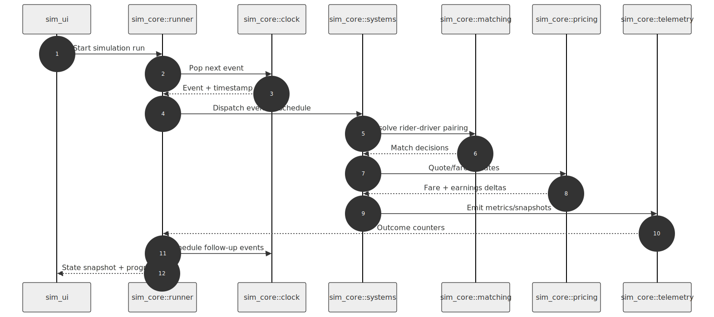
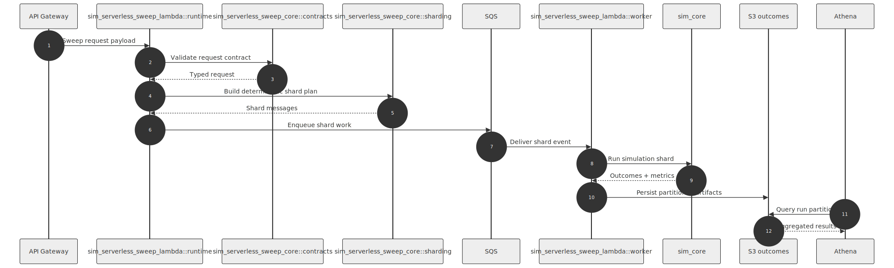
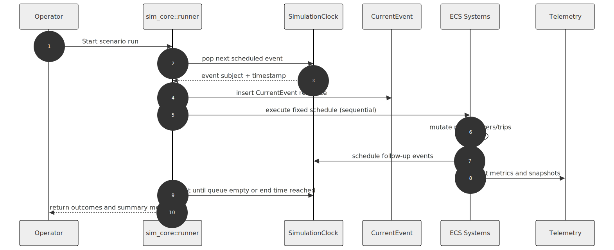
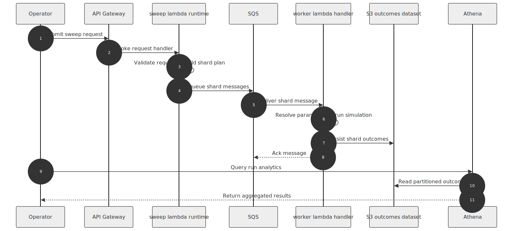
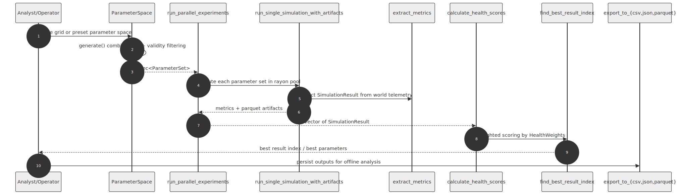
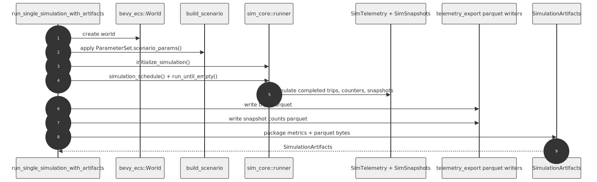

# Architecture Diagrams

This directory stores architecture diagrams as code and committed rendered outputs.

## Layout

- `src/` - Mermaid source files (`.mmd`)
- `rendered/` - Generated SVG files committed to the repository

## Baseline Diagram Set

- Module interaction sequences
  - `src/modules/local-runtime-modules.mmd`
  - `src/modules/serverless-runtime-modules.mmd`
- Runtime flow sequences
  - `src/sequence/simulation-event-loop.mmd`
  - `src/sequence/serverless-sweep-run.mmd`
- Experimentation framework
  - `src/experiments/experimentation-sweep-pipeline.mmd`
  - `src/experiments/experimentation-single-run-artifacts.mmd`

## Render Locally

Use the canonical render command from repository root:

```sh
python scripts/render_diagrams.py
```

Requirements:

- Python 3.10+
- Node.js 20+ (`npx` must be available)

The renderer uses a pinned Mermaid CLI version for deterministic output.

In CI, the renderer automatically applies `scripts/puppeteer-config-ci.json` so
headless Chromium can run in restricted Linux sandboxes.

## Validate Render Freshness

To verify all committed SVGs are up to date:

```sh
bash scripts/check_rendered_diagrams.sh
```

This command is what CI runs. If it fails, regenerate diagrams and commit both source and rendered changes.

## Rendered Previews

### Module Interactions





### Runtime Flows





### Experimentation Framework




